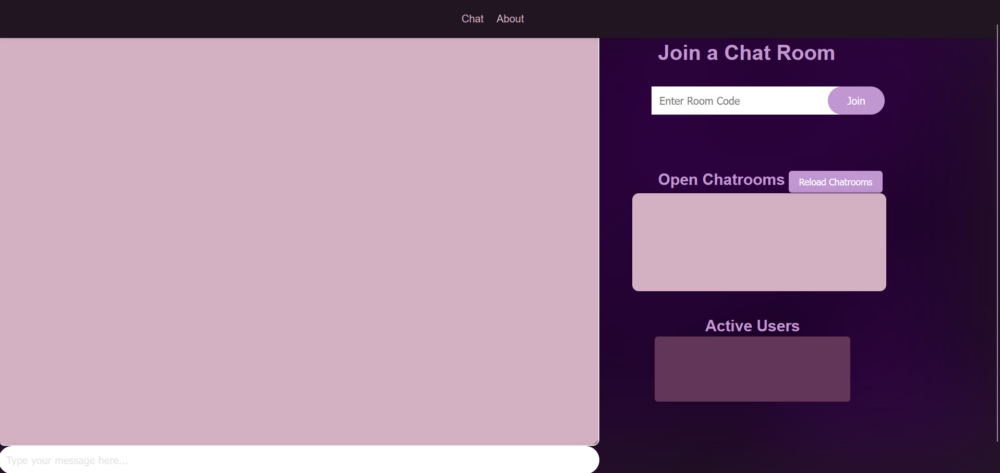
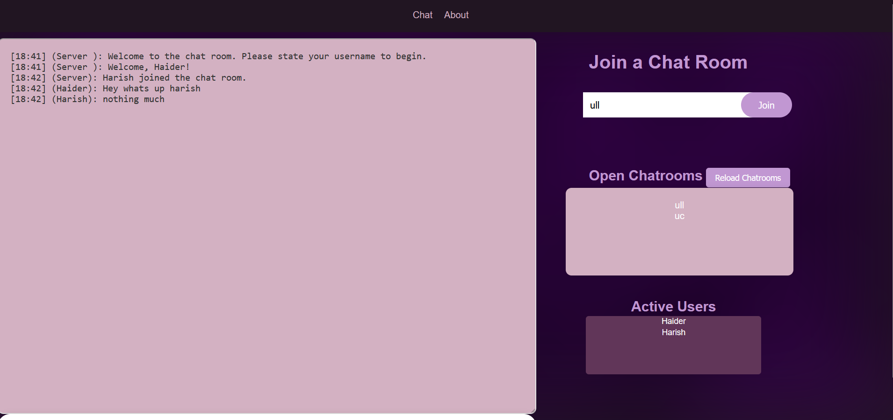

(a). This is a chat server that allows users to create chat rooms and chat with other users in real time.
The server is written in Java. The server uses WebSockets to communicate with the client. 
The client is written in JavaScript and uses the WebSockets to communicate with the server.

(b). The improvements that were made to the server are as follows:
1. The server now supports multiple chat rooms.
2. The server now supports multiple users in a chat room.
3. Readability on the client side using css.
4. The layout of the chat room is now more user friendly.
5. The color scheme makes it easy on the eyes.
6. the navigatabliity of the chat/about room is more user friendly.
7. The client side supports different resolutions.

(c). Steps to run the server:
1. get repository from github cloned
2. open the project and download dependencies
3. setup glassfish server
4. change the history file path in the server
5. run the server
6. open the client in a browser
7. enter room code and username
8. chat away

(d). resources used outside of assigned:
1. jakarta.ws.rs.api
2. guicedee.services.jakarta.ws.rs.api
through maven